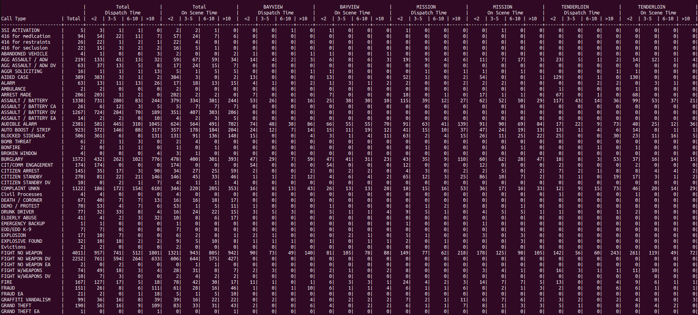

# Processing large CSV files (with multithreading)

## This program processes a large CSV file (100k lines) and visualizes the data in an easy to read format.

A data structure keeps track of every event type (specifically the field `call_type_final_desc`, if that field is blank, use the `call_type_original_desc` field).  With each event type the total number of calls, the number of calls where the dispatch time is 2 minutes or less, from 3 to 5 minutes, 6 to 10 minute, and over 10 minutes, and the on scene times are 2 minutes or less, from 3 to 5 minutes, 6 to 10 minute, and over 10 minutes are tracked.  It also selectively keeps track of those times for either 3 neighborhoods or police districts.  Specifically 3 values from the `analysis_neighborhood` field or the `police_district` field depending on the command line parameters. Dispatch time is calculated by parsing and subtracting the `received_datetime` from the `dispatch_datetime`. The on scene time is calculated by parsing and subtracting the `enroute_datetime` from the `onscene_datetime`.

This program supports, and is meant to be used with, multithreading. Critical sections are protected with mutex locks and only thread safe library calls are used.

**Command Line Parameters**
```
<program> <csv filename> <threads> <subfield> <subfield value 1> <subfield value 2> <subfield value 3>
Ex: ./lawprocessor_main Law100K.csv 4 police_district BAYVIEW MISSION TENDERLOIN
Ex: ./lawprocessor_main Law100K.csv 2 analysis_neighborhood "Outer Richmond" "Glen Park" Mission
```


